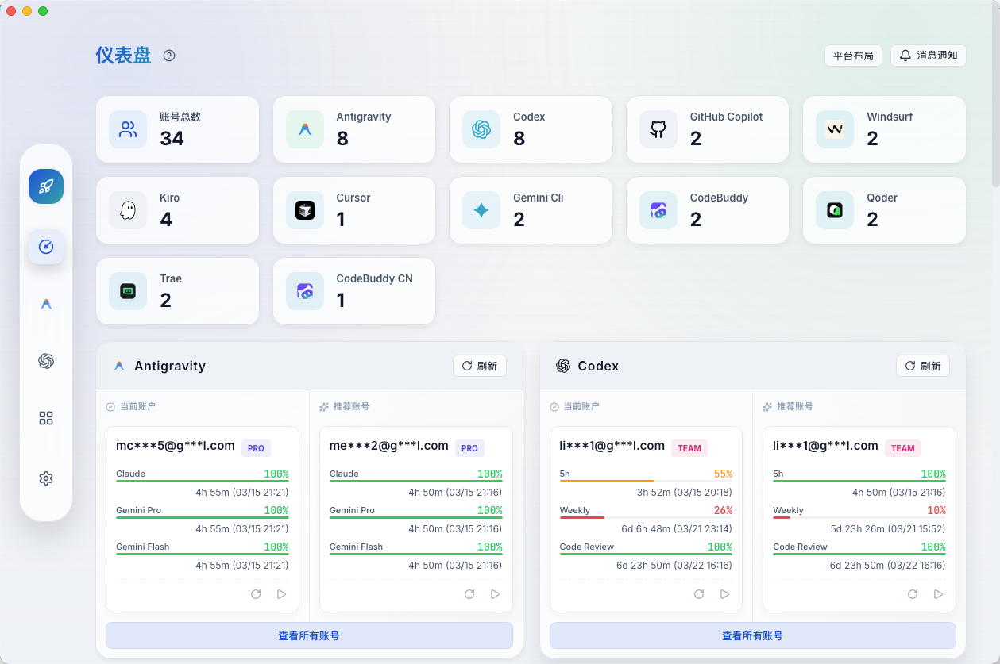
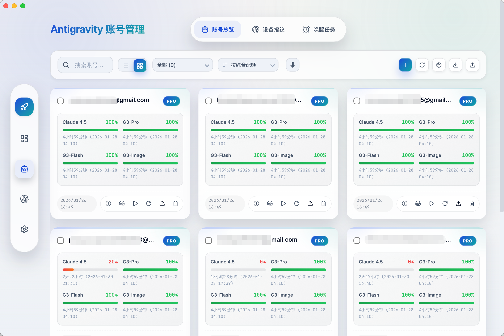
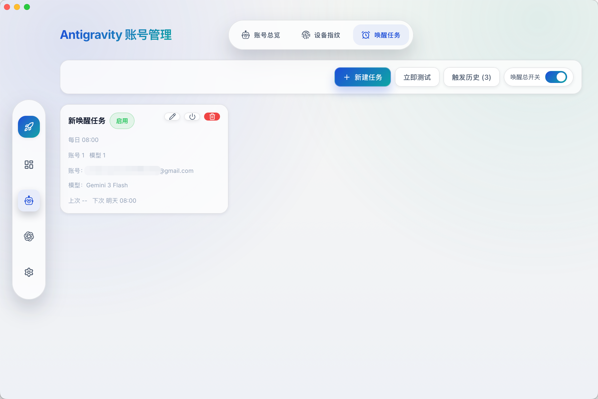
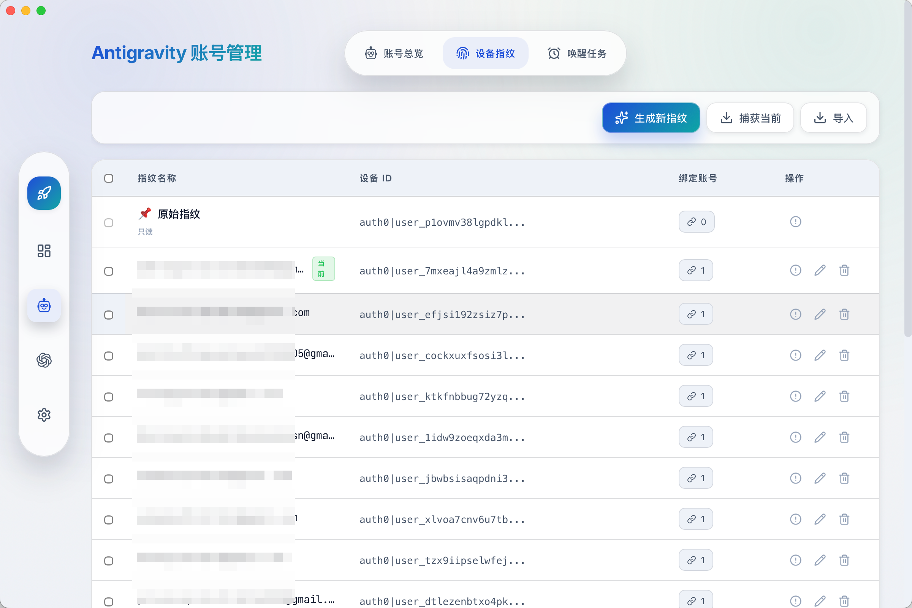
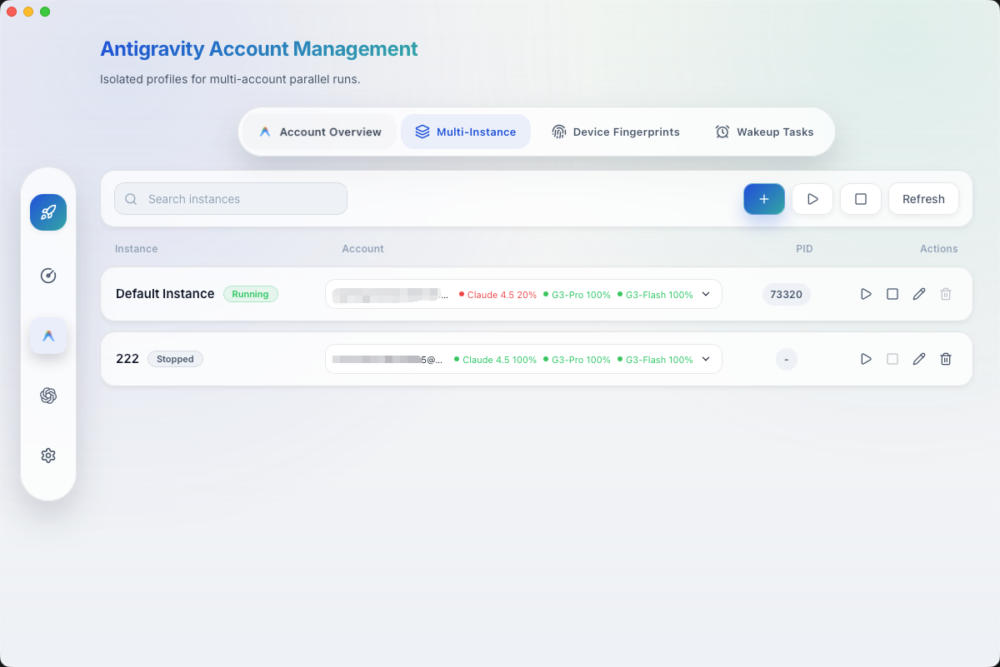
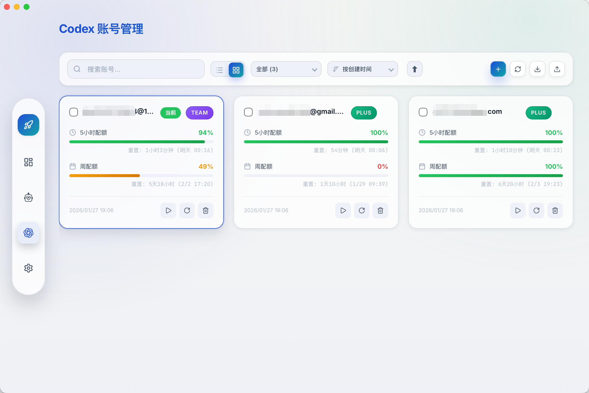
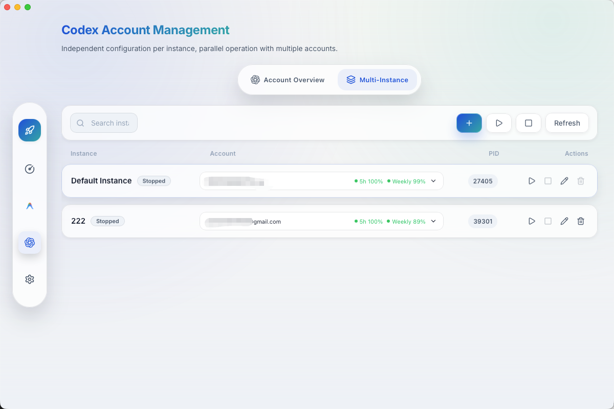
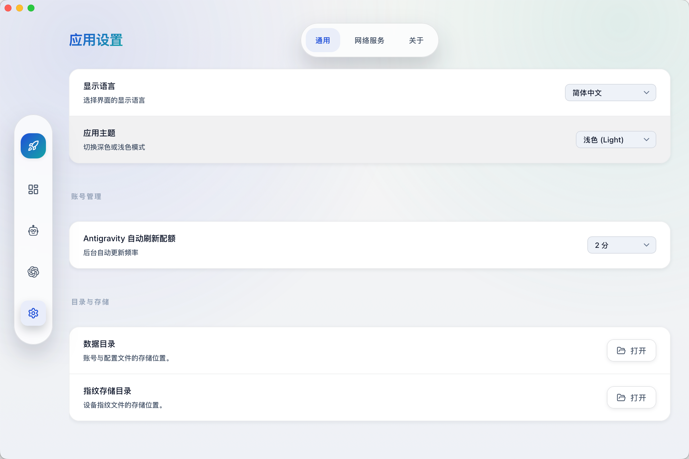

# ai switch

> 版本: v0.16.3 | 更新: 2026-03-19

一款**通用的 AI IDE 账号管理工具**，目前支持 **Antigravity**、**Codex**、**GitHub Copilot**、**Windsurf**、**Kiro**、**Cursor**、**Gemini Cli**、**CodeBuddy**、**CodeBuddy CN**、**WorkBuddy**、**Qoder** 和 **Trae**，并支持多账号多实例并行运行。

> 本工具旨在帮助用户高效管理多个 AI IDE 账号，支持一键切换、配额监控、自动唤醒与多开实例并行运行，助您充分利用不同账号的资源。

**功能**：一键切号 · 多账号管理 · 多开实例 · 配额监控 · 唤醒任务 · 设备指纹 · 插件联动 · API 网关 · 本地代理 · Sub2api 中转 · GitHub Copilot 管理 · Windsurf 管理 · Kiro 管理 · Cursor 管理 · Gemini Cli 管理 · CodeBuddy 管理 · CodeBuddy CN 管理 · WorkBuddy 管理 · Qoder 管理 · Trae 管理

**语言**：支持 17 种语言

🇺🇸 English · 🇨🇳 简体中文 · 繁體中文 · 🇯🇵 日本語 · 🇩🇪 Deutsch · 🇪🇸 Español · 🇫🇷 Français · 🇮🇹 Italiano · 🇰🇷 한국어 · 🇧🇷 Português · 🇷🇺 Русский · 🇹🇷 Türkçe · 🇵🇱 Polski · 🇨🇿 Čeština · 🇸🇦 العربية · 🇻🇳 Tiếng Việt

---
---
项目参考
1. https://github.com/farion1231/cc-switch — Claude / Codex / Gemini 等 Key 配置
2. https://github.com/jlcodes99/cockpit-tools — 多账号切换（本项目主体）
3. https://github.com/qxcnm/Codex-Manager — Codex 反代（已集成至 Gateway 模块）
4. https://github.com/Wei-Shaw/sub2api — Claude / OpenAI / Gemini / Antigravity 中转（已集成至 Sub2api 模块）
5.https://github.com/libaxuan/cursor2api-go    cursor官网逆向出免费的模型
6.（ cursor：  https://github.com/ibrahim317/cursor-chat-transfer）（https://github.com/lohasle/AI-Conversation-Viewer）
获取ai（例如cursor，trae等）本地对话记录，可以迁移至另一台电脑   
7.（https://github.com/junhoyeo/tokscale）（https://github.com/ramo-dev/tokwatch）可以获取ai本地token使用量

## 功能概览

### 1. 仪表盘 (Dashboard)

全新的可视化仪表盘，为您提供一站式的状态概览：

- **十二平台支持**：同时展示 Antigravity、Codex、GitHub Copilot、Windsurf、Kiro、Cursor、Gemini Cli、CodeBuddy、CodeBuddy CN、WorkBuddy、Qoder 与 Trae 的账号状态
- **配额监控**：实时查看各模型剩余配额、重置时间
- **快捷操作**：一键刷新、一键唤醒
- **可视化进度**：直观的进度条展示配额消耗情况

> 

### 2. Antigravity 账号管理

- **一键切号**：一键切换当前使用的账号，无需手动登录登出
- **多种导入**：支持 OAuth 授权、Refresh Token、插件同步
- **唤醒任务**：定时唤醒 AI 模型，提前触发配额重置周期
- **设备指纹**：生成、管理、绑定设备指纹，降低风控风险

> 
>
> *(唤醒任务与设备指纹管理)*
> 
> 

#### 2.1 Antigravity 多开实例

支持同一平台多账号多实例并行运行。比如同时打开两个 Antigravity，分别绑定不同账号，分别处理不同项目，互不影响。

- **独立账号**：每个实例绑定不同账号并独立运行
- **并行项目**：多实例同时处理不同任务/项目
- **参数隔离**：支持自定义实例目录与启动参数

> 

### 3. Codex 账号管理

- **专属支持**：专为 Codex 优化的账号管理体验
- **配额展示**：清晰展示 Hourly 和 Weekly 配额状态
- **计划识别**：自动识别账号 Plan 类型 (Basic, Plus, Team 等)

> 

#### 3.1 Codex 多开实例

Codex 同样支持多账号多实例并行运行。比如同时打开两个 Codex，分别绑定不同账号，分别处理不同项目，互不影响。

- **独立账号**：每个实例绑定不同账号并独立运行
- **并行项目**：多实例同时处理不同任务/项目
- **参数隔离**：支持自定义实例目录与启动参数

> 

### 4. GitHub Copilot 账号管理

- **账号导入**：支持 OAuth 授权、Token/JSON 导入
- **配额视图**：展示 Inline Suggestions / Chat messages 使用情况与重置时间
- **订阅识别**：自动识别 Free / Individual / Pro / Business / Enterprise 等计划类型
- **批量管理**：支持标签与批量操作

#### 4.1 GitHub Copilot 多开实例

基于 VS Code 的 Copilot 多实例管理，支持独立配置与生命周期控制。

- **独立配置**：每个实例拥有独立的用户目录
- **快速启停**：一键启动/停止/强制关闭实例
- **窗口管理**：支持打开实例窗口与批量关闭

### 5. Windsurf 账号管理

- **账号导入**：支持 OAuth 授权、Token/JSON 导入与本地导入
- **配额视图**：展示 Plan、User Prompt credits、Add-on prompt credits 与周期信息
- **批量管理**：支持标签与批量操作
- **切号注入**：支持切号后注入并启动 Windsurf

#### 5.1 Windsurf 多开实例

支持 Windsurf 多实例管理，支持独立配置与生命周期控制。

- **独立配置**：每个实例拥有独立的用户目录
- **快速启停**：一键启动/停止/强制关闭实例
- **窗口管理**：支持打开实例窗口与批量关闭

### 6. Kiro 账号管理

- **账号导入**：支持 OAuth 授权、Token/JSON 导入与本地导入
- **配额视图**：展示 Plan、User Prompt credits、Add-on prompt credits 与周期信息
- **批量管理**：支持标签与批量操作
- **切号注入**：支持切号后注入并启动 Kiro

#### 6.1 Kiro 多开实例

支持 Kiro 多实例管理，支持独立配置与生命周期控制。

- **独立配置**：每个实例拥有独立的用户目录
- **快速启停**：一键启动/停止/强制关闭实例
- **窗口管理**：支持打开实例窗口与批量关闭

### 7. Cursor 账号管理

- **账号导入**：支持 OAuth 授权、Token/JSON 导入与本地导入
- **配额视图**：展示 Total Usage、Auto + Composer、API Usage、On-Demand 与周期信息
- **批量管理**：支持标签与批量操作
- **切号注入**：支持切号后注入并启动 Cursor

#### 7.1 Cursor 多开实例

支持 Cursor 多实例管理，支持独立配置与生命周期控制。

- **独立配置**：每个实例拥有独立的用户目录
- **快速启停**：一键启动/停止/强制关闭实例
- **窗口管理**：支持打开实例窗口与批量关闭

### 8. Gemini Cli 账号管理

- **账号导入**：支持 OAuth 授权、Token/JSON 导入与本地导入
- **配额视图**：展示 Total Usage、Auto + Composer、API Usage、On-Demand 与周期信息
- **批量管理**：支持标签与批量操作
- **切号注入**：支持切号后注入 Gemini Cli 本地凭证（`~/.gemini`）
- **平台限制**：Gemini Cli 暂不支持多开实例管理

### 9. CodeBuddy 账号管理

- **账号导入**：支持 OAuth 授权、Token/JSON 导入
- **配额视图**：支持配额查询、周期信息与加量包展示
- **批量管理**：支持标签与批量操作
- **切号注入**：支持切号后注入并启动 CodeBuddy

#### 9.1 CodeBuddy 多开实例

支持 CodeBuddy 多实例管理，支持独立配置与生命周期控制。

- **独立配置**：每个实例拥有独立的用户目录
- **快速启停**：一键启动/停止/强制关闭实例
- **窗口管理**：支持打开实例窗口与批量关闭

### 10. CodeBuddy CN 账号管理

- **账号导入**：支持 OAuth 授权、Token/JSON 导入与本机客户端导入
- **配额视图**：展示套餐与用量状态，并支持跳转官方网页查看配额详情
- **批量管理**：支持标签与批量操作
- **切号注入**：支持切号后按客户端本地认证存储规则注入并启动 CodeBuddy CN

#### 10.1 CodeBuddy CN 多开实例

支持 CodeBuddy CN 多实例管理，支持独立配置与生命周期控制。

- **独立配置**：每个实例拥有独立的用户目录
- **快速启停**：一键启动/停止/强制关闭实例
- **窗口管理**：支持打开实例窗口与批量关闭

### 11. WorkBuddy 账号管理

- **账号导入**：支持 OAuth 授权、Token/JSON 导入与本机客户端导入
- **批量管理**：支持标签与批量操作
- **切号注入**：支持切号后注入并启动 WorkBuddy（VS Code 插件）
- **与 CodeBuddy CN 同步**：支持从 CodeBuddy CN 同步账号到 WorkBuddy，或将当前 WorkBuddy 账号同步到 CodeBuddy CN

#### 11.1 WorkBuddy 多开实例

支持 WorkBuddy 多实例管理，支持独立配置与生命周期控制。

- **独立配置**：每个实例拥有独立的用户目录
- **快速启停**：一键启动/停止/强制关闭实例
- **窗口管理**：支持打开实例窗口与批量关闭
- **平台支持**：多开实例支持 macOS、Windows 与 Linux

### 12. Qoder 账号管理

- **账号导入**：支持本机导入与 JSON 导入
- **配额视图**：展示 Credits 使用、剩余额度与套餐原始值
- **批量管理**：支持标签、筛选、导出与批量删除/刷新
- **切号注入**：支持切号后注入并启动 Qoder

#### 12.1 Qoder 多开实例

支持 Qoder 多实例管理，支持独立配置与生命周期控制。

- **独立配置**：每个实例拥有独立的用户目录
- **快速启停**：一键启动/停止/强制关闭实例
- **窗口管理**：支持打开实例窗口与批量关闭

### 13. Trae 账号管理

- **账号导入**：支持本机导入与 JSON 导入
- **配额视图**：展示套餐原始值、美元消耗/总额度与重置时间
- **批量管理**：支持标签、筛选、导出与批量删除/刷新
- **切号注入**：支持切号后按客户端落盘规则写回并启动 Trae

#### 13.1 Trae 多开实例

支持 Trae 多实例管理，支持独立配置与生命周期控制。

- **独立配置**：每个实例拥有独立的用户目录
- **快速启停**：一键启动/停止/强制关闭实例
- **窗口管理**：支持打开实例窗口与批量关闭

### 14. 通用设置

- **个性化设置**：主题切换、语言设置、自动刷新间隔
- **平台配置**：统一管理 CodeBuddy CN / WorkBuddy / Qoder / Trae 等平台的启动路径与配额预警

> 

### 15. API 网关 (Gateway)

内置 API 网关服务，将十二平台账号统一为 Token 池，对外提供兼容 OpenAI 格式的 API 接口。

- **统一账号池**：自动从 Antigravity、Codex、GitHub Copilot、Windsurf、Kiro、Cursor、Gemini Cli、CodeBuddy、CodeBuddy CN、WorkBuddy、Qoder、Trae 同步账号
- **负载均衡**：支持 RoundRobin / LeastUsed / Random / Priority / QuotaAware 五种路由策略
- **API Key 管理**：生成 API Key 并控制调用权限与速率限制
- **请求日志**：记录每次 API 调用的模型、Token 消耗、延迟与状态
- **协议适配**：自动将请求适配到不同平台的上游 API，支持平台级自定义 Upstream URL
- **账号桥接**：一键将多平台账号同步到网关数据库，无需手动逐个添加

### 16. 本地代理 (Local Proxy)

内置本地透明代理，拦截 Claude / Codex / Gemini 等 AI IDE 的 API 请求，实时记录用量。

- **透明拦截**：无需修改 IDE 配置，代理自动捕获 API 调用
- **用量统计**：按模型、时间维度汇总 Token 消耗
- **TLS 支持**：自动生成本地 CA 证书，支持 HTTPS 代理

### 17. Sub2api 中转 (Sub2api Relay)

集成独立的 Sub2api 子进程（Go 编写），将 Subscription 转为标准 API 格式。

- **子进程管理**：一键启停 Sub2api 实例，自动管理生命周期
- **嵌入式 UI**：通过 iframe 嵌入 Sub2api 管理界面
- **账号同步**：支持将平台账号池自动同步到 Sub2api 实例
- **独立端口**：Sub2api 运行在独立端口，与主应用隔离

---

## 安全性与隐私（简明版）

下面是最关心的几个问题，尽量用直白语言说明：

- **这是本地桌面工具**：不需要单独注册平台账号，也不依赖项目自建云端来存你的账号列表。
- **数据主要保存在本机**：
  - `~/.antigravity_cockpit`：Antigravity 账号、配置、WebSocket 状态等
  - `~/.codex`：Codex 官方当前登录 `auth.json`
  - `~/.gemini`：Gemini Cli 本地会话文件（如 `oauth_creds.json`、`google_accounts.json`、`settings.json`）
  - 系统本地应用数据目录下 `com.antigravity.cockpit-tools`：Codex / GitHub Copilot / Windsurf / Kiro / Cursor / Gemini Cli / CodeBuddy / CodeBuddy CN / WorkBuddy / Qoder / Trae 多账号索引等
- **WebSocket 默认仅本机访问**：监听 `127.0.0.1`，默认端口 `19528`，可在设置中关闭或改端口。
- **什么时候会联网**：OAuth 登录、Token 刷新、配额查询、版本更新检查等官方接口请求。
- **实用安全建议**：
  1. 不使用插件联动时，可关闭 WebSocket 服务。
  2. 不要把用户目录直接打包分享；备份前注意脱敏 token 文件。
  3. 在公共或共用电脑上，使用后删除账号并退出应用。

## 设置项说明（小白版）

如果你只想"能用、稳定、不折腾"，优先按"推荐值"设置即可。

### 通用设置

| 设置项 | 这是做什么的（通俗） | 推荐值 | 什么时候改 |
| --- | --- | --- | --- |
| 显示语言 | 改界面文字语言 | 你最熟悉的语言 | 只在看不懂时改 |
| 应用主题 | 改亮色/暗色外观 | 跟随系统 | 长时间夜间使用可改深色 |
| 窗口关闭行为 | 点关闭按钮后的动作 | 每次询问 | 想后台常驻选"最小化到托盘" |
| Antigravity 自动刷新配额 | 后台定时更新 Antigravity 配额 | 5~10 分钟 | 账号多、想更实时可改 2 分钟 |
| Codex 自动刷新配额 | 后台定时更新 Codex 配额 | 5~10 分钟 | 同上 |
| GitHub Copilot 自动刷新配额 | 后台定时更新 GitHub Copilot 配额 | 5~10 分钟 | 同上 |
| Windsurf 自动刷新配额 | 后台定时更新 Windsurf 配额 | 5~10 分钟 | 同上 |
| Kiro 自动刷新配额 | 后台定时更新 Kiro 配额 | 5~10 分钟 | 同上 |
| Cursor 自动刷新配额 | 后台定时更新 Cursor 配额 | 5~10 分钟 | 同上 |
| Gemini Cli 自动刷新配额 | 后台定时更新 Gemini Cli 配额 | 5~10 分钟 | 同上 |
| CodeBuddy 自动刷新配额 | 后台定时更新 CodeBuddy 配额 | 5~10 分钟 | 同上 |
| CodeBuddy CN 自动刷新配额 | 后台定时更新 CodeBuddy CN 配额 | 5~10 分钟 | 同上 |
| Qoder 自动刷新配额 | 后台定时更新 Qoder 配额 | 5~10 分钟 | 同上 |
| Trae 自动刷新配额 | 后台定时更新 Trae 配额 | 5~10 分钟 | 同上 |
| WorkBuddy 自动刷新配额 | 后台定时更新 WorkBuddy 配额 | 5~10 分钟 | 同上 |
| 数据目录 | 存账号与配置文件的位置 | 默认即可 | 仅用于排查、备份 |
| Antigravity/Codex/VS Code/Windsurf/Kiro/Cursor/Gemini Cli/CodeBuddy/CodeBuddy CN/WorkBuddy/Qoder/Trae/OpenCode 启动路径 | 指定应用可执行文件位置 | 留空（自动检测） | 自动检测失败、或你装在自定义路径时 |
| 切换 Codex 时自动重启 OpenCode | 切换 Codex 后自动同步 OpenCode 账号信息 | 使用 OpenCode 就开启；不用就关闭 | 频繁切号且需要 OpenCode 同步时开启 |

补充说明：
- 自动刷新间隔越小，请求越频繁；若你更关注稳定，间隔可适当拉大。
- 当启用"配额重置唤醒"相关任务时，部分刷新间隔会有最小值限制（界面会提示）。

### 网络服务设置

| 设置项 | 这是做什么的（通俗） | 推荐值 | 风险/注意点 |
| --- | --- | --- | --- |
| WebSocket 服务 | 给本机插件/客户端实时通信用 | 不用插件联动就关闭 | 开启后仍是本机 `127.0.0.1` 访问 |
| 首选端口 | WebSocket 监听端口 | 默认 `19528` | 若端口冲突可改，保存后需重启应用 |
| 当前运行端口 | 实际已使用端口 | 只读查看 | 配置端口被占用时会自动回退到其它端口 |

### 三套推荐配置（直接抄）

1. **稳定省心**：自动刷新 10 分钟 + WebSocket 关闭（不用插件时）+ 路径保持默认。  
2. **高频切号**：自动刷新 2~5 分钟 + 需要联动时开启 WebSocket + OpenCode 联动开启。  
3. **安全优先**：WebSocket 关闭 + 不共享用户目录 + 定期清理不再使用的账号。  

---

## 安装指南 (Installation)

### 选项 A: 手动下载 (推荐)

前往 [GitHub Releases](https://github.com/jlcodes99/cockpit-tools/releases) 下载对应系统的安装包：

*   **macOS**: `.dmg` (Apple Silicon & Intel)
*   **Windows**: `.msi` (推荐) 或 `.exe`
*   **Linux**: `.deb` (Debian/Ubuntu) 或 `.AppImage` (通用)

### 选项 B: Homebrew 安装 (macOS)

> 需要先安装 Homebrew。

```bash
brew tap jlcodes99/cockpit-tools https://github.com/jlcodes99/cockpit-tools
brew install --cask cockpit-tools
```

如果遇到 macOS "应用已损坏"或无法打开，也可以使用 `--no-quarantine` 安装：

```bash
brew install --cask --no-quarantine cockpit-tools
```

如果提示已存在应用（例如：`already an App at '/Applications/ai switch.app'`），请先删除旧版本再安装：

```bash
rm -rf "/Applications/ai switch.app"
brew install --cask cockpit-tools
```

或者直接强制覆盖安装：

```bash
brew install --cask --force cockpit-tools
```

### 🛠️ 常见问题排查 (Troubleshooting)

#### macOS 提示"应用已损坏，无法打开"？
由于 macOS 的安全机制，非 App Store 下载的应用可能会触发此提示。您可以按照以下步骤快速修复：

1.  **命令行修复** (推荐):
    打开终端，执行以下命令：
    ```bash
    sudo xattr -rd com.apple.quarantine "/Applications/ai switch.app"
    ```
    > **注意**: 如果您修改了应用名称，请在命令中相应调整路径。

2.  **或者**: 在"系统设置" -> "隐私与安全性"中点击"仍要打开"。

---

## 开发与构建

### 前置要求

- **Node.js**: v20+
- **npm**: v9+
- **Rust**: 1.70+ (Tauri 2.0 运行时)
- **系统依赖**：
  - macOS: Xcode Command Line Tools
  - Windows: Microsoft Visual C++ Build Tools
  - Linux: `libwebkit2gtk-4.0-dev`, `libssl-dev`, `libgtk-3-dev`, `libayatana-appindicator3-dev`

### 技术栈

- **前端**: React 19 + TypeScript 5.8 + Vite 7
- **状态管理**: Zustand 5
- **UI 框架**: Tailwind CSS 3.4 + DaisyUI 5.5
- **国际化**: react-i18next 16.5
- **后端**: Rust + Tauri 2.0
- **构建工具**: Vite 7 + Tauri CLI 2

### 安装依赖

```bash
npm install
```

### 开发模式

```bash
npm run tauri dev
```

这将启动：
- Vite 开发服务器（前端热重载）
- Tauri 应用窗口
- Rust 代码自动重新编译（修改后）

### 构建产物

```bash
npm run tauri build
```

构建产物将输出到 `src-tauri/target/release/bundle/` 目录。

### 类型检查

```bash
npm run typecheck
```

### 版本同步

在发布前，确保所有配置文件中的版本号一致：

```bash
npm run sync-version
```

---

## 项目结构

```
Open Switch/
├── src/                              # React 前端源码
│   ├── components/                  # 可复用组件
│   ├── pages/                       # 页面组件
│   │   ├── DashboardPage.tsx        # 仪表盘
│   │   ├── AccountsPage.tsx         # Antigravity 账号
│   │   ├── Codex/Copilot/...        # 各平台账号页
│   │   ├── GatewayDashboardPage.tsx # Gateway 仪表盘
│   │   ├── GatewayAccountPoolPage   # Gateway 账号池
│   │   ├── GatewayApiKeysPage.tsx   # API Key 管理
│   │   ├── GatewayRequestLogPage    # 请求日志
│   │   └── Sub2apiPage.tsx          # Sub2api 管理
│   ├── stores/                      # Zustand 状态管理
│   │   ├── useGatewayStore.ts       # Gateway 状态
│   │   ├── useSub2apiStore.ts       # Sub2api 状态
│   │   └── use*AccountStore.ts      # 各平台账号状态
│   ├── services/                    # API 服务层
│   ├── types/                       # TypeScript 类型定义
│   ├── hooks/                       # React Hooks
│   ├── utils/                       # 工具函数
│   ├── i18n/                        # 国际化配置
│   └── App.tsx                      # 应用入口
│
├── src-tauri/                        # Rust 后端源码
│   ├── src/
│   │   ├── commands/               # Tauri 命令（IPC 接口）
│   │   │   ├── gateway.rs          # Gateway 命令
│   │   │   ├── subprocess.rs       # Sub2api 子进程命令
│   │   │   ├── opencode/           # OpenCode 配置命令
│   │   │   └── ...                 # 各平台账号/实例命令
│   │   ├── modules/                # 业务模块
│   │   │   ├── gateway/            # API 网关
│   │   │   │   ├── account_pool.rs          # 账号池与负载均衡
│   │   │   │   ├── account_pool_bridge.rs   # 多平台账号桥接
│   │   │   │   ├── api_key.rs               # API Key 管理
│   │   │   │   ├── proxy.rs                 # 反代代理逻辑
│   │   │   │   ├── protocol_adapter.rs      # 协议适配
│   │   │   │   ├── router.rs                # 路由分发
│   │   │   │   ├── db.rs                    # SQLite 存储
│   │   │   │   └── server.rs                # HTTP 服务器
│   │   │   ├── subprocess/         # 子进程管理
│   │   │   │   ├── sub2api.rs               # Sub2api 启停
│   │   │   │   └── sub2api_sync.rs          # 账号同步到 Sub2api
│   │   │   ├── proxy/              # 本地透明代理
│   │   │   │   ├── server.rs                # 代理服务器
│   │   │   │   ├── handlers.rs              # 请求处理
│   │   │   │   └── usage/                   # 用量统计
│   │   │   ├── opencode_config/    # OpenCode 配置管理
│   │   │   └── ...                 # 账号/OAuth/设备指纹等
│   │   ├── lib.rs                  # 库入口（命令注册）
│   │   └── main.rs                 # 应用入口
│   ├── binaries/                   # 外部二进制（sub2api）
│   └── Cargo.toml                  # Rust 依赖配置
│
├── docs/                            # 项目文档
│   ├── images/                     # 文档图片
│   ├── DONATE.md                   # 赞助文档
│   └── release-process.md          # 发布流程
│
├── package.json                     # Node.js 依赖配置
├── tsconfig.json                    # TypeScript 配置
├── vite.config.ts                  # Vite 配置
└── README.md                       # 项目说明（本文件）
```

---

## Star History

[](https://star-history.com/#jlcodes99/cockpit-tools&Date)

---

## ☕ 赞助项目

如果不介意，请 [☕ 赞赏支持一下](docs/DONATE.md)

您的每一份支持都是对开源项目最大的鼓励！无论金额大小，都代表着您对这个项目的认可。

---

## 致谢

- Antigravity 账号切号逻辑参考：[Antigravity-Manager](https://github.com/lbjlaq/Antigravity-Manager)

感谢项目作者的开源贡献！如果这些项目对你有帮助，也请给他们点个 ⭐ Star 支持一下！

---

## 许可证

[CC-BY-NC-SA-4.0](LICENSE)

---

## 免责声明

本项目仅供个人学习和研究使用。使用本项目即表示您同意：

- 不将本项目用于任何商业用途
- 承担使用本项目的所有风险和责任
- 遵守相关服务条款和法律法规

项目作者对因使用本项目而产生的任何直接或间接损失不承担责任。
